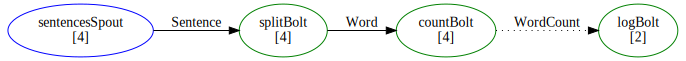

## FsShelter

FsShelter is an F# library for building stream-processing pipelines. Define typed data flows where sources produce messages and processors transform and route them through a directed graph — all with compile-time safety and high-performance in-process execution.



Here's what a topology looks like — a schema, components, and the graph connecting them:

```fsharp
// Every DU case is a typed stream
type Schema = 
    | Sentence of string
    | Word of string
    | Count of string * int64
```

```fsharp
// Wire components into a graph
let myTopology = topology "WordCount" {
    let spout = sentences |> Spout.runUnreliable (fun log cfg -> source) ignore
    let split = splitWords |> Bolt.run (fun log cfg t emit -> (t, emit))
    let count = countWords |> Bolt.run (fun log cfg t emit -> (t, emit))

    yield spout --> split |> Shuffle.on Sentence
    yield split --> count |> Group.by (function Word w -> w)
}

// Run it — no infrastructure required
let shutdown = Hosting.run myTopology

```

## Packages

The library is split into two packages:

* **FsShelter** — the core library for defining topologies and running them in-process. Depends only on Disruptor for high-performance message passing.

* **FsShelter.Multilang** — [Apache Storm](https://storm.apache.org/) cluster integration: task execution via the multilang protocol, Nimbus client for topology submission, and JSON/Protobuf serializers.

Use `FsShelter` alone for [self-hosted](self-hosting.html) topologies. Add `FsShelter.Multilang` when deploying to a Storm cluster.

## Documentation

### Getting started

* [Core Concepts](concepts.html) — Key terminology, schema, components, DSL, and delivery modes explained from scratch

* [Word Count](wordcount.html) — Tutorial: build a complete fire-and-forget word count topology

* [Guaranteed delivery](guaranteed.html) — Tutorial: reliable spouts with ack/nack and anchoring

### Reference

* [Schema](schema.html) — Grouping expressions, record flattening, serializer details, special streams

* [Running Topologies](self-hosting.html) — Entry points, configuration, tuning, diagnostics

* [Routing](routing.html) — How tuples are distributed: Shuffle, Fields, All, Direct

### Deep dives

* [Architecture](architecture.html) — Internal runtime structure: tasks, executors, channels, lifecycle

* [Message Flow](message-flow.html) — End-to-end processing scenarios with sequence diagrams

* [Acker Algorithm](acker-algorithm.html) — XOR-tree tracking for guaranteed message processing

### API

* [API Reference](../reference/index.html) — Auto-generated documentation for public types, modules, and functions

## Getting FsShelter

The core library (topology DSL, self-hosting runtime) can be installed from [NuGet](https://nuget.org/packages/FsShelter):

```fsharp
dotnet add package FsShelter

```

For Storm cluster deployment, add the multilang package from [NuGet](https://nuget.org/packages/FsShelter.Multilang):

```fsharp
dotnet add package FsShelter.Multilang

```

## Contributing and copyright

The project is hosted on [GitHub](https://github.com/FsStorm/FsShelter) where you can [report issues](https://github.com/FsStorm/FsShelter/issues), fork
the project and submit pull requests. If you're adding a new public API, please also
consider adding [samples](https://github.com/FsStorm/FsShelter/tree/master/docs/content) that can be turned into a documentation. You might
also want to read the [library design notes](https://github.com/FsStorm/FsShelter/blob/master/README.md) to understand how it works.

The library is available under Apache 2.0 license, which allows modification and
redistribution for both commercial and non-commercial purposes. For more information see the
[License file](https://github.com/FsStorm/FsShelter/blob/master/LICENSE.md) in the GitHub repository.
